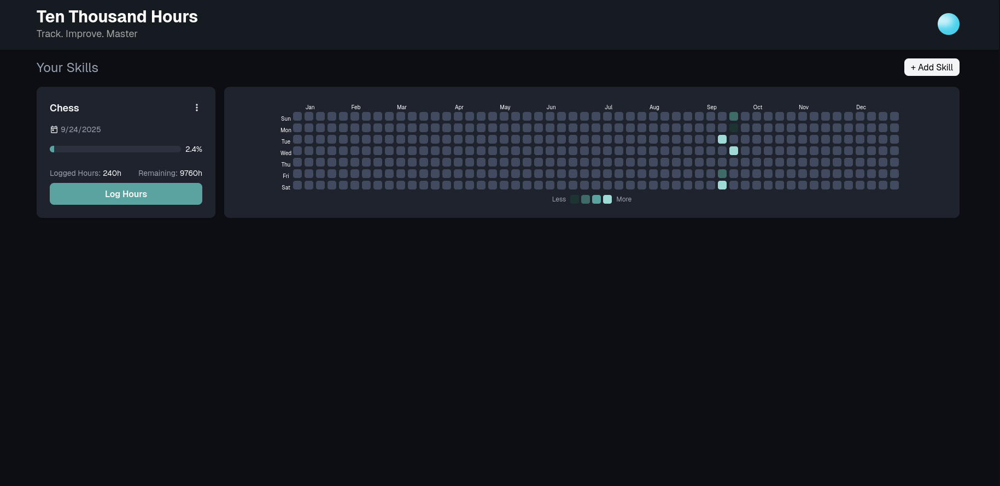

# Ten Thousand Hours

A React web app inspired by the 10,000-Hour Rule that helps users track their journey toward skill mastery. Log daily practice hours, visualize progress with a GitHub-style heatmap, and manage multiple skills with customizable themes.

## Preview



## Features

- Authentication — Sign up and log in with Email/Password or Google.
- Skill Cards — Add skills and track total hours.
- Heatmap View — Visualize your consistency across all skills.
- FireStore Integration — User-specific skill storage.
- Basic State Management — Context API for auth and skills.

## 🛠 Tech Stack


## Getting Started

### 1. Clone the repository

```bash
git clone https://github.com/haadi05/TenThousandHours.git
```

### 2. Navigate into the project folder

```bash
cd TenThousandHours
```

### 3. Install dependencies

```bash
npm install
```

### 4. Set up Firebase

```bash
Create a Firebase project in Firebase Console
Enable Authentication (Google + Email/Password)
Enable Firestore Database
Copy your Firebase config into firebase.js
```

### 5. Start development server

```bash
npm run dev
```

## Roadmap (Planned for v2)

- Edit skill cards after adding them
- Detailed history of daily logs
- Faster load times and Firestore query optimization
- Improved heatmap performance and customization
